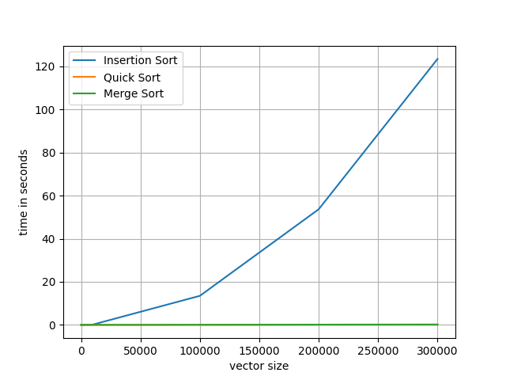
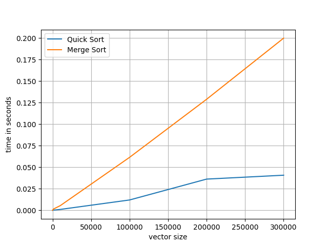

# Assignment 1 document
## question 2
1. n = 10
    - insertion sort : 9e-06 seconds
    - merge sort : 6e-05 seconds
    - quick sort : 1e-06 seconds
2. n = 100
    - insertion sort : 6.5e-05 seconds
    - merge sort : 0.000111 seconds
    - quick sort : 1.2e-05 seconds
3. n = 1000
    - insertion sort : 0.00397 seconds
    - merge sort : 0.001418 seconds
    - quick sort : 0.000219 seconds
4. n = 10000
    - insertion sort : 0.160486 seconds
    - merge sort : 0.005429 seconds
    - quick sort : 0.001055 seconds
5. n = 100000
    - insertion sort : 13.4974 seconds
    - merge sort : 0.061544 seconds
    - quick sort : 0.012035 seconds
6. n = 200000
    - insertion sort : 53.7029 seconds
    - merge sort : 0.128986 seconds
    - quick sort : 0.036277 seconds
7. n = 300000
    - insertion sort : 123.487 seconds
    - merge sort : 0.199978 seconds
    - quick sort : 0.040789 seconds

